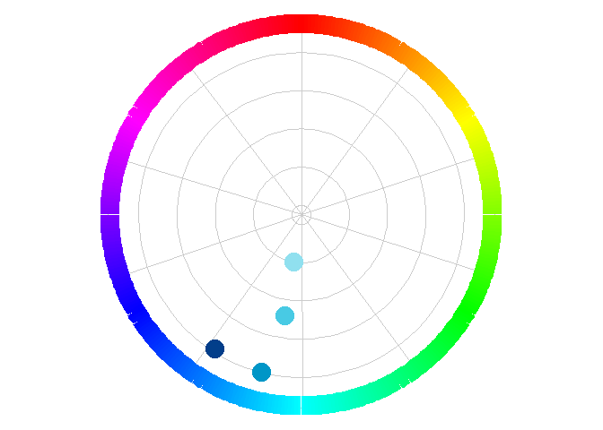
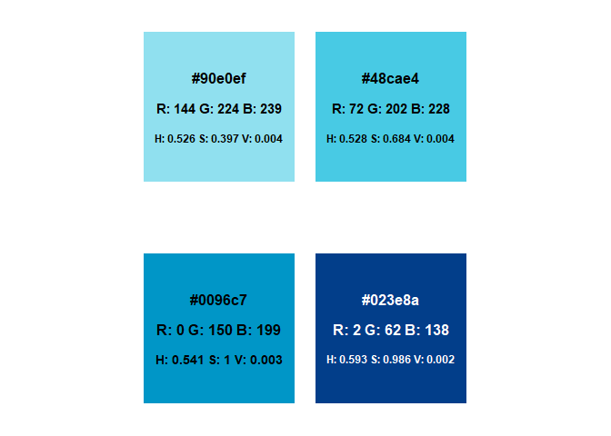

<!-- README.md is generated from README.Rmd. Please edit that file -->

# swatches

<!-- badges: start -->

<!-- badges: end -->

The goal of swatches is to give basic functions for displaying color
palettes on color wheel and as swatches

## Installation

You can install the development version of swatches from
[GitHub](https://github.com/) with:

``` r
# install.packages("remotes")
remotes::install_github("mic-wypych/swatches")
```

## Examples

You can plot a colorwheel of a palette like this:

``` r
library(swatches)

pal <- c("#90e0ef", "#48cae4", "#0096c7", "#023e8a")
plot_wheel(pal)
```



``` r
library(swatches)

pal <- c("#90e0ef", "#48cae4", "#0096c7", "#023e8a")
plot_swatch(pal)
```


